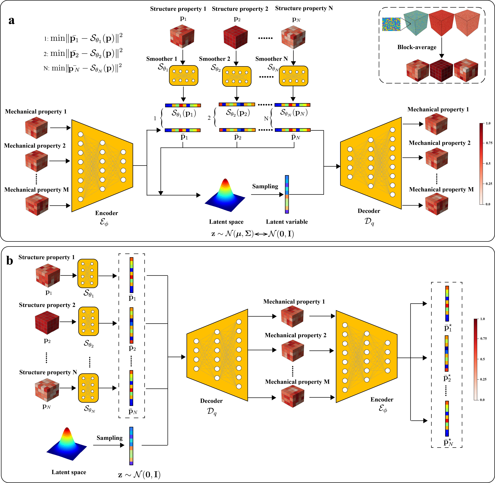

<div align="center">

# AlloyVAE: A generative model for complex probabilistic field-to-field relationships in alloys


[](https://arxiv.org/abs/2604.02281)

Ningyu Yan¹, Zhuocheng Xie², Kai Guo³, Yejun Gu³,⁴,\*, Huajian Gao⁵,\*, Yang Xiang¹,⁶,\*

<div align="center">
  <p>1. Department of Mathematics, The Hong Kong University of Science and Technology, Clear Water Bay, Kowloon, Hong Kong, China</p>
  <p>2. Department of Materials Science & Engineering, University of Toronto, Ontario, Canada M5S 3E4</p>
  <p>3. Institute of High Performance Computing, Agency for Science, Technology and Research, Singapore 138632</p>
  <p>4. Department of Mechanical Engineering, Whiting School of Engineering, Johns Hopkins University, Baltimore, MD, USA 21218</p>
  <p>5. Mechano-X Institute, Applied Mechanics Laboratory, Department of Engineering Mechanics, Tsinghua University, Beijing, China 100084</p>
  <p>6. HKUST Shenzhen–Hong Kong Collaborative Innovation Research Institute, Shenzhen, China</p>
</div>


\* *Corresponding authors*

</div>

---

## Abstract

<div align="justify" style="font-size: 0.95em; text-align: justify; line-height: 1.6;">

The inherent compositional heterogeneity of multi-principal element alloys (MPEAs) gives rise to complex, spatially varying mechanical fields that cannot be uniquely determined from coarse-grained composition descriptors. This non-uniqueness introduces intrinsically probabilistic structure–property relationships, posing a fundamental challenge to conventional deterministic modeling and machine learning approaches that collapse such mappings into average predictions. Here, we present AlloyVAE, a physics-informed generative framework that learns the full conditional distribution of mechanical fields from microstructural inputs. Built upon a conditional variational autoencoder architecture, the model incorporates learned smoothing operators to enhance functional regularity and a self-consistency mechanism to enforce physical plausibility. Trained on atomistic simulation data, AlloyVAE accurately predicts distributions of residual stress fields from composition and short-range order, and enables the generation of multiple physically consistent realizations under identical input conditions. Beyond forward prediction, the framework supports inverse design by optimizing composition fields to achieve targeted mechanical responses, and is extensible to coupled mappings involving eigenstrain. By capturing one-to-many structure–property relationships in heterogeneous materials, this work establishes a probabilistic paradigm for materials modeling and design, providing a scalable alternative to conventional simulations for navigating high-dimensional compositional spaces.

</div>

 <!-- 你可以把图片放在 assets 文件夹下 -->

# CVAE-Based Microstructure-to-Stress Modeling

This repository contains a three-stage workflow for tungsten-carbide microstructure learning and design:

1. `dataset/`: convert raw MD simulation outputs into block-averaged tensors and normalized training arrays.
2. `model_training/`: define and train a conditional variational autoencoder (CVAE) that maps microstructure descriptors to stress fields.
3. `material_design/`: optimize concentration fields with a trained CVAE checkpoint for inverse material design.

## Recommended Conda Environment

Python `3.11` is recommended. Avoid `Python 3.13` for this project because it is more likely to cause package compatibility issues in Jupyter and PyTorch-based workflows.

```bash
conda create -n cvae-wc python=3.11 -y
conda activate cvae-wc
```

### Core packages

These are the minimum packages needed for the main GitHub workflow:

```bash
pip install numpy scikit-learn
pip install torch
```

If you want notebook-based inspection and visualization, also install:

```bash
pip install matplotlib seaborn umap-learn jupyter ipykernel
```

### Optional packages for legacy scripts

Some older scripts in `model_training/` import utilities from `dataset.py`, which adds extra dependencies:

```bash
pip install pillow torchvision albumentations
```

If you only use the cleaned GitHub versions, these are not strictly necessary. However, the current `model_training/trainCVAEWC2_github.py` still imports `MapDataset` from `dataset.py`, so either:

- install the optional packages above, or
- change the import to `from dataset_github import MapDataset`

### GPU note

Training and optimization are much faster on GPU. Install a CUDA-enabled PyTorch build that matches your machine if GPU acceleration is needed. If not, the CPU build of PyTorch also works for basic testing.

## Folder Overview

### `dataset/`

This folder prepares the learning dataset from MD simulations.

- [dataprocess.py](/d:/plot/code_release/dataset/dataprocess.py) reads raw atomistic dump files in `MD_sim_examples/`, bins atoms into 3D blocks, and computes block-wise concentration, Warren-Cowley descriptors, and stress averages.
- [normalization_github.py](/d:/plot/code_release/dataset/normalization_github.py) merges block-averaged `.npy` files, downsamples from the original resolution to `4 x 4 x 4`, applies `MinMaxScaler`, shuffles samples, and produces the final training arrays:
  - `X_WC_3500.npy`
  - `Y_WC_3500.npy`
- [normalization.py](/d:/plot/code_release/dataset/normalization.py) is the older path-specific version of the same preprocessing logic.

In short, `dataset/` converts raw simulation outputs into normalized tensors ready for model training.

### `model_training/`

This folder contains the CVAE model and training scripts.

- [CVAEWC_github.py](/d:/plot/code_release/model_training/CVAEWC_github.py) defines the main CVAE architecture:
  - 3D convolutional encoder for stress fields
  - smoothing/projection modules for concentration and SRO/WC conditions
  - latent reparameterization
  - decoder that reconstructs the stress field from latent variables and learned condition embeddings
- [dataset_github.py](/d:/plot/code_release/model_training/dataset_github.py) provides a lightweight PyTorch `Dataset` wrapper.
- [trainCVAEWC2_github.py](/d:/plot/code_release/model_training/trainCVAEWC2_github.py) loads `X_WC_3500.npy` and `Y_WC_3500.npy`, splits training data, trains the CVAE, stores loss curves, and saves checkpoints.
- [checkCVAEWC0215.ipynb](/d:/plot/code_release/model_training/checkCVAEWC0215.ipynb) is an analysis notebook for model evaluation, latent-space inspection, and prediction visualization.

In short, `model_training/` turns normalized dataset tensors into a trained generative surrogate model.

### `material_design/`

This folder performs inverse design using a trained checkpoint.

- [optimize1000_c_0211.py](/d:/plot/code_release/material_design/optimize1000_c_0211.py) loads a trained CVAE model, initializes candidate concentration fields and latent noise, then iteratively optimizes them to improve a target stress-related objective while keeping the generated structure self-consistent.

In short, `material_design/` uses the trained CVAE as a design engine rather than only a predictor.

## Suggested Workflow

1. Prepare or verify the raw block-averaged data in `dataset/block_averaged_data/`.
2. Run [normalization_github.py](/d:/plot/code_release/dataset/normalization_github.py) to generate `dataset/X_WC_3500.npy` and `dataset/Y_WC_3500.npy`.
3. Run [trainCVAEWC2_github.py](/d:/plot/code_release/model_training/trainCVAEWC2_github.py) to train the CVAE and save checkpoints.
4. Use [checkCVAEWC0215.ipynb](/d:/plot/code_release/model_training/checkCVAEWC0215.ipynb) for evaluation and visualization.
5. Run [optimize1000_c_0211.py](/d:/plot/code_release/material_design/optimize1000_c_0211.py) for inverse material design with a trained checkpoint.

## Important Notes

- Several non-GitHub scripts still contain machine-specific absolute paths such as `/home/...`. Update them before running on a new machine.
- The cleaned `*_github.py` scripts are the best starting point for public use.
- The notebook and optimization scripts assume that training checkpoints already exist.


<!-- ## Features

- ✅ **Dense Matching**: Robust feature matching across frames.
- ✅ **Multi-View Foundation Models**: Leverage pre-trained models for better generalization.
- ✅ **Gaussian Splatting**: High-quality static scene reconstruction.
- ✅ **Real-Time Tracking**: Efficient pose estimation via bundle adjustment.

---

## Installation

```bash
git clone https://github.com/yourusername/M3.git
cd M3
pip install -r requirements.txt -->
